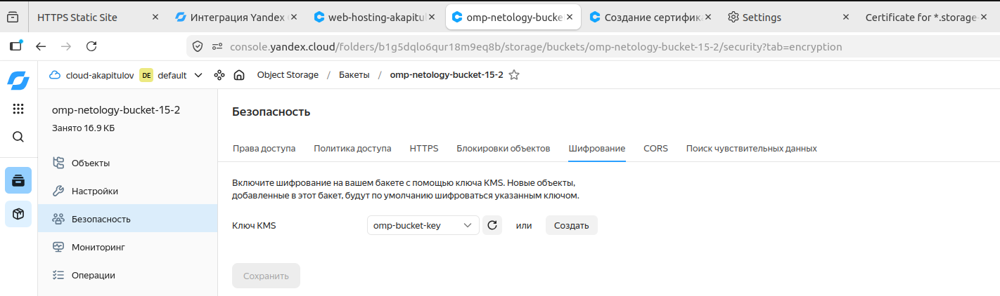
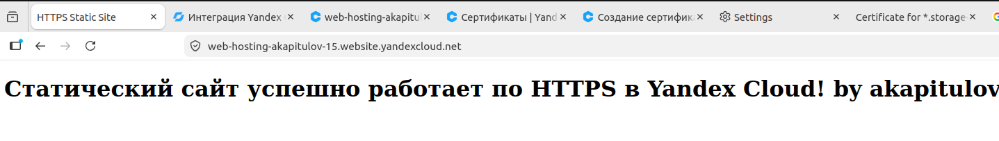

## Задание 1. Yandex Cloud

### 1. Шифрование содержимого бакета с помощью ключа KMS

Конфигурация симметричного ключа шифрования и интеграция с бакетом в `src/main.tf`:

```hcl
resource "yandex_kms_symmetric_key" "bucket_key" {
  name              = "omp-bucket-key"
  description       = "Ключ KMS для шифрования бакета"
  default_algorithm = "AES_256"
}

resource "yandex_storage_bucket" "lamp_bucket" {
  access_key = var.storage_access_key
  secret_key = var.storage_secret_key
  bucket     = var.bucket_name

  anonymous_access_flags {
    read = true
    list = false
  }

  server_side_encryption_configuration {
    rule {
      apply_server_side_encryption_by_default {
        kms_master_key_id = yandex_kms_symmetric_key.bucket_key.id
        sse_algorithm     = "aws:kms"
      }
    }
  }
}
```


---

### 2. Создание статического сайта в Object Storage и настройка HTTPS


**Результат проверки работы сайта по HTTPS:**  


---

